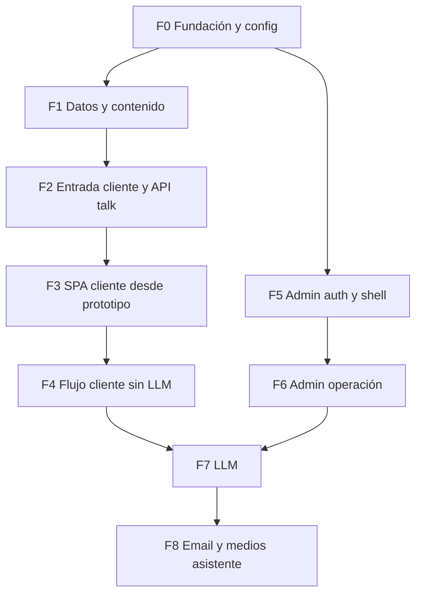

# Plan de implementación — Web Interviewer MVP

**Status:** v0.2  
**Last updated:** 2026-05-22  
**Objetivo:** implementar el MVP en **entregables medianos**, cada uno **configurable**, **validable** y **extensible** para los siguientes pasos.

---

## 1. Cómo usar este documento

### 1.1 Principios (acordados)


| Principio                       | Significado en la práctica                                                                                                                                                                                |
| ------------------------------- | --------------------------------------------------------------------------------------------------------------------------------------------------------------------------------------------------------- |
| **Entregables pequeños**        | Un entregable ≈ 0,5–2 días; un PR o rama corta; no mezclar admin + LLM + email en el mismo corte si se puede evitar.                                                                                      |
| **Validable**                   | Cada entregable incluye una sección **Validación** con comandos o pasos manuales concretos. No se marca “hecho” sin pasar esa lista.                                                                      |
| **Preparado para lo siguiente** | Cada entregable deja **contratos estables** (rutas, tablas, interfaces) y documenta **puntos de extensión**; las fases posteriores no reescriben las anteriores, solo las consumen.                       |
| **Configuración explícita**     | Toda variable de entorno, secreto, Docker o servicio externo aparece en **Configuración** del entregable que lo introduce (no “al final del proyecto”).                                                   |
| **Docs vs prototipo**           | `docs/` define **modelos, APIs y comportamiento**; `docs/prototype/` es **referencia de implementación** para el flujo cliente (misma UX que el prototipo), no checklist de componentes en documentación. |


### 1.2 Plantilla de entregable

Cada bloque `### En — …` sigue esta estructura:

1. **Depende de** — entregables previos obligatorios
2. **Configuración** — pasos de setup (copiar env, levantar servicios, claves)
3. **Alcance** — qué se construye en este corte
4. **Extensión** — qué queda listo para el siguiente entregable (APIs, flags, stubs)
5. **Validación** — cómo comprobar que funciona
6. **Referencias** — docs del repo

### 1.3 Estado y orden

- Implementar **en orden de fase** salvo que un entregable indique dependencias cruzadas.  
- Marcar en este archivo o en issues: `pendiente` → `en curso` → `validado`.  
- Si la validación revela un hueco en REQ o técnico, actualizar `docs/requierements/` o `docs/technical/` **antes** de acumular deuda en código.

### 1.4 Fuera de alcance del primer corte

Ver [functional-requirements.md §9](../requierements/functional-requirements.md) y [architecture.md §12](../technical/architecture.md): colas, Slack/WhatsApp, abandono automático, CMS de preguntas, multi-tenant, encuestas/funnel avanzado, sentimientos configurables en admin.

### 1.5 Decisiones de producto (cerradas 2026-05-22)


| #   | Tema                      | Decisión                                                                                                                                                                                                                                            |
| --- | ------------------------- | --------------------------------------------------------------------------------------------------------------------------------------------------------------------------------------------------------------------------------------------------- |
| 1   | Loader + aura             | Portar **como el prototipo**; el loader **precarga assets** y ejecuta **bootstrap** (`GET /api/talk` tras cookie).                                                                                                                                  |
| 2   | Bienvenida                | `assistantIntro` **antes** de privacy; `contactName` / `businessName` del **invite en BD** vía bootstrap del loader.                                                                                                                                |
| 3   | Entre fases               | Delight **como el prototipo** (`phaseTransition` + `PhaseIntroScreen`).                                                                                                                                                                             |
| 4   | Documentación             | Sin inventario de componentes React en `docs/`; validar **comportamiento** y contratos.                                                                                                                                                             |
| 5   | Sentimientos              | JSON fijo (`id`, nombre, imagen, description); LLM elige `sentimentId`; **una imagen por sentimiento** (sin variantes tú/usted en MVP); catálogo admin **post-MVP**.                                                                                |
| 6   | Admin lista               | Misma **marca** que el prototipo; **layout libre**; columnas: estado, fechas, progreso (p. ej. 12/19).                                                                                                                                              |
| 7   | Email cliente             | HTML **simple** (título, párrafos, Q/A).                                                                                                                                                                                                            |
| 8   | Al completar              | Persistir **respuestas usuario + mensajes AI** de la conversación; **no** generar análisis estudio. Análisis desde admin con botón (**JSON por secciones**: perfil psicológico, estrategias, necesidades, próximos pasos, riesgos, citas clave, …). |
| 9   | Sesión                    | Cookie entrevista **máx. 7 días** (alineada al JWT) con **renovación sliding** en cada actividad.                                                                                                                                                   |
| 10  | Artefacto análisis        | **JSON estructurado** por secciones fijas.                                                                                                                                                                                                          |
| 11  | `POST /api/talk/complete` | Marcar completada + **notificar al equipo** (email); **sin LLM** en este endpoint.                                                                                                                                                                  |
| 12  | Echo micro-reply          | **Recomendado en prompt** cuando encaje; no obligatorio; no en skip.                                                                                                                                                                                |
| 13  | Imágenes Lisa             | **Todos** los sentimientos del catálogo con imagen **antes** de cerrar MVP cliente.                                                                                                                                                                 |
| 14  | Métricas                  | Solo lo del listado admin (§6); sin encuesta cliente ni rating interno en MVP.                                                                                                                                                                      |
| —   | UX cliente                | El cliente ve **lo mismo que el prototipo** (incl. despedida); no rediseñar ese flujo.                                                                                                                                                              |


**Desvío respecto a REQ v0.6:** el resumen estudio deja de generarse en `complete` y pasa a **on-demand en admin** (actualizar `functional-requirements.md` / `architecture.md` cuando se implemente).

---

## 2. Mapa de fases




| Fase   | Objetivo de la fase                                      | Entregables            |
| ------ | -------------------------------------------------------- | ---------------------- |
| **F0** | Repo ejecutable localmente con MySQL en Docker           | E0.1, E0.2, E0.3       |
| **F1** | Esquema y contenido de entrevista en BD                  | E1.1, E1.2             |
| **F2** | Enlace de invitación → cookie → bootstrap API            | E2.1, E2.2             |
| **F3** | UI `/talk` como prototipo + catálogo sentimientos        | E3.1, E3.2, E3.3, E3.4 |
| **F4** | Guardar respuestas y completar sin LLM                   | E4.1, E4.2             |
| **F5** | Login Google y rutas `/admin`                            | E5.1, E5.2             |
| **F6** | Panel: invitaciones, ajustes, revisión                   | E6.1, E6.2, E6.3       |
| **F7** | Gemini: micro-reply + análisis estudio on-demand (admin) | E7.1, E7.2, E7.3       |
| **F8** | Email (estudio + copia cliente)                          | E8.1                   |

### 2.1 Progreso de entregables

**Completados:** 22 / 22

| Entregable | Fase | Hecho |
| ---------- | ---- | ----- |
| E0.1 | F0 | [x] |
| E0.2 | F0 | [x] |
| E0.3 | F0 | [x] |
| E1.1 | F1 | [x] |
| E1.2 | F1 | [x] |
| E2.1 | F2 | [x] |
| E2.2 | F2 | [x] |
| E3.1 | F3 | [x] |
| E3.2 | F3 | [x] |
| E3.3 | F3 | [x] |
| E3.4 | F3 | [x] |
| E4.1 | F4 | [x] |
| E4.2 | F4 | [x] |
| E5.1 | F5 | [x] |
| E5.2 | F5 | [x] |
| E6.1 | F6 | [x] |
| E6.2 | F6 | [x] |
| E6.3 | F6 | [x] |
| E7.1 | F7 | [x] |
| E7.2 | F7 | [x] |
| E7.3 | F7 | [x] |
| E8.1 | F8 | [x] |

---

## F0 — Fundación y configuración

### E0.1 — Bootstrap monorepo Laravel + React

**Depende de:** —  

**Configuración**

- PHP 8.2+, Composer, Node 20+, npm.  
- Crear `.env` desde `.env.example` (aún sin secretos externos).  
- `APP_KEY` generado (`php artisan key:generate`).

**Alcance**

- Laravel 11 en raíz del repo.  
- Vite + React 18 + Tailwind + React Router en `resources/js/` (o estructura equivalente documentada en README raíz).  
- Blade sirve `index.html` para rutas SPA (`/talk`, `/admin/`*).  
- Rutas web mínimas: fallback SPA para `/talk` y `/admin/{any}`.  
- Health check: `GET /up` o ruta simple que devuelva 200.

**Extensión**

- Scripts en `composer.json` / `package.json`: `dev` (concurrently: `artisan serve` + `vite`).  
- Carpetas vacías o README para `app/Services/Llm/`, `content/` (futuro seed y training).

**Validación**

```bash
composer install && npm install
php artisan serve   # terminal 1
npm run dev         # terminal 2
curl -s -o /dev/null -w "%{http_code}" http://127.0.0.1:8000/up   # esperado: 200
```

- Abrir `/talk` en navegador: SPA carga (puede ser placeholder “Talk”).

**Referencias:** [architecture.md §1–2](../technical/architecture.md)

---

### E0.2 — Docker MySQL y plantilla de entorno

**Depende de:** E0.1  

**Configuración**

- Añadir en repo: `docker-compose.yml` (MySQL 8, volumen, puerto `3306`).  
- Documentar en `.env.example`:

```dotenv
DB_CONNECTION=mysql
DB_HOST=127.0.0.1
DB_PORT=3306
DB_DATABASE=web_interviewer
DB_USERNAME=web_interviewer
DB_PASSWORD=secret

# Placeholders — se rellenan en entregables posteriores
GOOGLE_CLIENT_ID=
GOOGLE_CLIENT_SECRET=
GOOGLE_REDIRECT_URI=http://127.0.0.1:8000/auth/google/callback
ACTION_JWT_SECRET=
GEMINI_API_KEY=
MAIL_MAILER=log
```

- Pasos operativos (en README raíz o `docs/plan/local-setup.md` si hace falta):
  1. `docker compose up -d`
  2. Copiar `.env.example` → `.env`
  3. `php artisan migrate` (cuando existan migraciones en E1.1)

**Alcance**

- Compose funcional; credenciales alineadas con `.env.example`.  
- Sin lógica de negocio nueva.

**Extensión**

- Mismo `.env.example` será la fuente de verdad; cada fase añade variables con comentario de entregable.

**Validación**

```bash
docker compose up -d
docker compose exec mysql mysql -uweb_interviewer -psecret -e "SELECT 1"
php artisan migrate:status   # conexión OK (aunque sin migraciones aún: no error de conexión)
```

**Referencias:** [architecture.md §8](../technical/architecture.md), [decisions.md](../technical/decisions.md)

---

### E0.3 — CSRF, cookies y cliente HTTP base

**Depende de:** E0.1  

**Configuración**

- `SESSION_DRIVER=database` (o `file` en local) + migración `sessions` si se usa database.  
- `SANCTUM` / CSRF: habilitar cookie CSRF para SPA same-origin (`config/sanctum.php` o middleware estándar Laravel para SPA).  
- `APP_URL=http://127.0.0.1:8000` coherente con Vite proxy si aplica.

**Alcance**

- Middleware y rutas API bajo `/api/`* con prefijo común.  
- Cliente fetch/axios en frontend: `credentials: 'include'`, lectura de cookie CSRF en mutaciones.  
- Endpoint de prueba autenticado por cookie de sesión de entrevista (stub 401/200) para validar el cableado.

**Extensión**

- `InterviewSessionMiddleware` (nombre provisional) registrado pero puede devolver 401 hasta E2.1.

**Validación**

- Request mutante sin CSRF → 419.  
- Request con CSRF + cookie de prueba (factory en test o ruta dev-only documentada) → 200.

**Referencias:** [auth.md](../technical/auth.md), [architecture.md §11](../technical/architecture.md)

---

## F1 — Datos y contenido

### E1.1 — Migraciones completas del dominio MVP

**Depende de:** E0.2  

**Configuración**

- `php artisan migrate` con Docker MySQL arriba.

**Alcance**

- Migraciones según [database-schema.md](../technical/database-schema.md): `users`, `settings`, `settings_channels`, plantilla (`interview_templates`, `phases`, `questions`, `question_texts`, `template_copies`), `invites`, `interviews`, `interview_sessions`, `answers`, `ai_messages`, `interview_artifacts`, `delivery_records`.  
- Índices y FKs del doc; sin soft deletes.

**Extensión**

- Modelos Eloquent con relaciones mínimas; factories opcionales para tests de API posteriores.

**Validación**

```bash
php artisan migrate:fresh
php artisan db:show   # tablas listadas
```

- Test o script que inserta fila en `settings` y `invites` sin error de FK.

**Hecho:** [x]

**Referencias:** [database-schema.md](../technical/database-schema.md), [domain-models.md](../requierements/domain-models.md)

---

### E1.2 — Seed: settings, plantilla de entrevista y comando de contenido

**Depende de:** E1.1  

**Configuración**

- Ninguna credencial externa.

**Alcance**

- `DatabaseSeeder`: fila singleton `settings` (`llm_enabled=true`, branding por defecto Idwasoft).  
- Seeder o comando `content:seed-interview` según [content-seed.md](../technical/content-seed.md) desde [plantilla-entrevista-descubrimiento.md](../plantilla-entrevista-descubrimiento.md).  
- Una plantilla activa; 19 preguntas alineadas con `docs/prototype/src/content/interview.json`.  
- Copias estáticas: privacy, tone, phase intros, farewell template keys.

**Extensión**

- `GET /api/talk` en E2.2 leerá esta plantilla; no duplicar JSON en el cliente salvo caché.

**Validación**

```bash
php artisan migrate:fresh --seed
php artisan tinker --execute="echo \App\Models\Question::count();"   # esperado: 19 (o el total del seed)
```

- Comparar fase/códigos de pregunta con `interview.json` del prototipo (misma cantidad y orden de fases).

**Hecho:** [x]

**Referencias:** [content-seed.md](../technical/content-seed.md), [ux-requirements.md §6](../requierements/ux-requirements.md)

---

## F2 — Entrada cliente y API talk (sin UI completa)

### E2.1 — Action JWT y `GET /invites?t=`

**Depende de:** E1.1, E0.3  

**Configuración**

```dotenv
ACTION_JWT_SECRET=<random-32-bytes-base64>
```

- Documentar generación del secreto en README.

**Alcance**

- Servicio `ActionJwtService`: emitir y verificar JWT en query `t` (TTL 7 días, ver [auth.md](../technical/auth.md)).  
- `GET /invites?t=`: válido → crear o cargar `interview` + `interview_session`, cookie HttpOnly (**TTL máx. 7 días**, **sliding** en actividad — ver §1.5), redirect 302 a `/talk`.  
- Invitación revocada / JWT inválido → redirect `/talk` con estado `revoked` (debe coincidir con escenario prototipo `revoked`).  
- Completada → redirect con estado `completed` (solo despedida, como prototipo).  
- Invite guarda `contact_name`, `business_name`, email cliente, etc. (admin E6.1).

**Extensión**

- Admin en E6.1 llamará al emisor de JWT; por ahora se puede crear invite vía `tinker`/seeder con URL de prueba.

**Validación**

1. Crear invite + JWT (factory/seeder).
2. `curl -I "http://127.0.0.1:8000/invites?t=…"` → `302` + `Set-Cookie`.
3. JWT expirado o revocado → comportamiento de cierre documentado.
4. Segunda visita con misma cookie → misma entrevista (mismo `interview_id`).
5. Tras actividad (`POST /api/answers`), la cookie se renueva (sliding); tras 7 días sin actividad, reentrada vía `/invites?t=…` restaura progreso.

**Hecho:** [x]

**Referencias:** [architecture.md §3–4](../technical/architecture.md), [functional-requirements.md §2–3](../requierements/functional-requirements.md), [prototype/NOTES.md §Edge scenarios](../prototype/NOTES.md)

---

### E2.2 — `GET` y `PATCH /api/talk` (bootstrap)

**Depende de:** E2.1, E1.2  

**Configuración**

- Cookie de entrevista tras pasar por `/invites`.

**Alcance**

- `GET /api/talk`: `status`, metadata invite, **contenido completo** de plantilla (preguntas, textos tu/usted, copias privacy/tone), `progress` (índice última pregunta, respuestas guardadas), branding desde `settings`.  
- `PATCH /api/talk`: `{ "register": "tu" | "usted" }` persistido en `interviews`.  
- Sin LLM; sin `POST /api/answers` aún.

**Extensión**

- Forma JSON estable documentada en comentario OpenAPI o `docs/technical/talk-api.md` (opcional, 1 página) para que E3.3 no adivine campos.

**Validación**

```bash
# Tras curl -c cookies.txt al flujo /invites
curl -b cookies.txt http://127.0.0.1:8000/api/talk | jq '.status, .questions | length'
curl -b cookies.txt -X PATCH -H "Content-Type: application/json" \
  -d '{"register":"tu"}' http://127.0.0.1:8000/api/talk
```

- Respuesta incluye 19 preguntas y textos por registro.  
- Sin cookie → 401.

**Hecho:** [x]

**Referencias:** [architecture.md §2.2](../technical/architecture.md), [talk-api.md](../technical/talk-api.md)

---

## F3 — SPA cliente (port desde prototipo)

### E3.1 — Loader (bootstrap) + shell `/talk` como el prototipo

**Depende de:** E0.1, E0.3, E2.2  

**Configuración**

- Vite: assets desde prototipo (`logo`, `pattern`, fuentes Sansation, retratos Lisa para preload).  
- Tras `/invites`, el cliente entra en `/talk` con cookie válida.

**Alcance**

- Portar **comportamiento visual del prototipo**: loader ~3s, `BootstrapAuraDock`, anillo → slot Lisa (§1.5 #1).  
- Durante el loader: (1) **precargar** imágenes/assets internos; (2) `**GET /api/talk`** — validar sesión/invite y obtener bootstrap (invite, branding, contenido, `progress`).  
- Portar shell: `InterviewShell`, layout móvil/desktop, `TopProgressLine`, tokens Tailwind.  
- Ruta React `/talk` única; estado de paso como prototipo.  
- Al terminar loader: datos en memoria para pasos siguientes (E3.2).

**Extensión**

- Caché cliente del payload bootstrap; E3.3 no vuelve a fetchear salvo refresh/relogin.

**Validación**

- `npm run dev` + flujo `/invites?t=…` → `/talk`: loader y aura visibles como prototipo.  
- Red desacelerada: loader cubre hasta que `GET /api/talk` responde.  
- `prefers-reduced-motion`: reglas del prototipo activas.  
- ~375px y desktop: barra inferior / scroll como [NOTES.md §Mobile](../prototype/NOTES.md).

**Hecho:** [x]

**Referencias:** [prototype/README.md](../prototype/README.md), [prototype/NOTES.md](../prototype/NOTES.md), [ux-requirements.md](../requierements/ux-requirements.md)

---

### E3.2 — Flujo cliente UI: intro → privacy → tone → fases (como prototipo)

**Depende de:** E3.1  

**Configuración**

- Bootstrap del loader ya en cliente (E3.1).

**Alcance**

- Portar pantallas y **orden del prototipo**: `assistantIntro` (nombre/negocio del invite) → **privacy** → **tone** → **phase 0** → loop preguntas con **phaseTransition** / `PhaseIntroScreen` al cambiar `phaseCode` → **farewell** (misma UX que prototipo; §1.5).  
- Incluir: `PrivacyScreen`, `ToneScreen`, `PhaseIntroScreen`, `RevokedScreen`, `FarewellScreen`, transiciones y delight entre fases.  
- `FarewellScreen`: templates con `{{contactName}}` / `{{businessName}}`; sin rediseño.  
- Estados `revoked` / `completed` desde bootstrap (sin dev switcher en producción).

**Extensión**

- `useInterviewFlow` (o equivalente) alimentado por bootstrap E3.1; persistencia en E3.3/E4.

**Validación**

- Happy path igual que prototipo: intro → privacy → tone → fase 0 → preguntas → delight entre fases → farewell.  
- Tone sin elegir → **usted** por defecto.  
- Revocado / completado → mismas pantallas que prototipo (`?scenario=` solo en dev local si se mantiene).

**Hecho:** [x]

**Referencias:** [prototype/NOTES.md §Covered flows](../prototype/NOTES.md)

---

### E3.3 — Persistencia en flujo: `PATCH` register, resume, revocado

**Depende de:** E3.2, E2.2  

**Configuración**

- Flujo: `/invites?t=…` → loader (E3.1) → pasos UI (E3.2).

**Alcance**

- Tone → `PATCH /api/talk` con `{ "register": "tu" | "usted" }` (copy tú/usted en preguntas; **retrato Lisa no cambia por registro en MVP**).  
- Reanudar en `progress.currentQuestionIndex` + respuestas ya guardadas (escenario `in_progress`).  
- Sincronizar estados `revoked` / `completed` con API tras bootstrap.  
- Sin `POST /api/answers` aún (E4.1).

**Extensión**

- Contrato JSON estable (`docs/technical/talk-api.md` opcional).

**Validación**

1. Invitación nueva: textos tu/usted correctos tras elegir registro.
2. Insertar respuestas en BD + recargar → resume en índice correcto.
3. Invite revocado → `RevokedScreen`.

**Hecho:** [x]

**Referencias:** [architecture.md §2.2](../technical/architecture.md), [functional-requirements.md §3](../requierements/functional-requirements.md)

---

### E3.4 — Catálogo de sentimientos (JSON + imágenes) y preload

**Depende de:** E3.1  

**Configuración**

- Assets en `public/assets/assistant/`; una imagen por `sentimentId`.  
- `content/assistant/sentiments.json`: `id`, `name`, `image`, `description` (§1.5 #5, #13).

**Alcance**

- Catálogo cerrado v1 (ids en [assistant-expression.md](../requierements/assistant-expression.md)).  
- **MVP:** una imagen por sentimiento; sin variantes tú/usted de retrato.  
- Integrar preload en loader (E3.1).  
- PNG del prototipo válidos hasta assets finales.

**Extensión**

- Post-MVP: variantes por registro; sentimientos editables en admin.

**Validación**

- Cada id del JSON → imagen HTTP 200.  
- Bloqueante para cerrar F3/F4 cliente y para habilitar E7.2.

**Hecho:** [x]

**Referencias:** [assistant-expression.md](../requierements/assistant-expression.md), [functional-requirements.md §4.4](../requierements/functional-requirements.md)

---

## F4 — Flujo cliente sin LLM

### E4.1 — `POST /api/answers` + UI pregunta / micro-reply (plantilla)

**Depende de:** E3.3, E2.2  

**Configuración**

- `settings.llm_enabled=false` en seed o PATCH admin (E6.2) — para este entregable forzar false en BD.

**Alcance**

- `POST /api/answers`: `{ questionId, answer, skipped }` → persiste `answers` + `ai_messages` con **plantilla** (sin llamada Gemini).  
- `sentimentId` válido del catálogo o fallback `atenta` ([assistant-expression.md](../requierements/assistant-expression.md)).  
- UI: `QuestionCard`, skeleton micro-reply, “Prefiero no contestar”, progreso.  
- Escenarios prototipo: `loading_answer` (delay configurable), `llm_off` (solo plantillas).

**Extensión**

- Interfaz `LlmClient` inyectada pero implementación `TemplateLlmClient` por defecto.

**Validación**

- Responder pregunta 1 → fila en `answers` + `ai_messages`.  
- Skip → `skipped=true`.  
- Con `llm_enabled=false`, ninguna llamada HTTP a Google (verificar logs / mock).  
- UI muestra micro-reply tras skeleton.

**Referencias:** [llm.md § toggle](../technical/llm.md), [functional-requirements.md §4.4](../requierements/functional-requirements.md)

**Hecho:** [x]

---

### E4.2 — `POST /api/talk/complete` + despedida (como prototipo)

**Depende de:** E4.1  

**Configuración**

- Plantillas de despedida en `template_copies` / seed.  
- Canal email estudio configurado (puede ser `MAIL_MAILER=log` hasta E8.1).

**Alcance**

- Completar solo si todas las preguntas respondidas o skipped.  
- `POST /api/talk/complete` → `interviews.status=completed`; persiste estado final (respuestas usuario + `ai_messages` ya guardados).  
- **Sin LLM** en este endpoint (§1.5 #11).  
- Despedida en UI: **misma experiencia que el prototipo** (`FarewellScreen`, copy plantilla / `lisa-farewell`, placeholders invite).  
- Persistir mensaje de despedida en `ai_messages` si aún no está (plantilla).  
- **No** crear `interview_artifacts` de análisis estudio aquí.  
- Disparar **notificación al equipo** (email “entrevista completada” + enlace admin) — implementación completa en E8.1; evento/handler preparado aquí.  
- Reapertura enlace → solo despedida (sin edición), como prototipo.

**Extensión**

- E8.1 refina plantillas de email; E7.3 genera análisis solo desde admin.

**Validación**

- Completar entrevista end-to-end: pantalla farewell = prototipo.  
- `GET /api/talk` en completada → no nuevas respuestas.  
- Segundo `POST /api/answers` → 409 o equivalente.  
- Admin/listado muestra `completed` + timestamp.

**Referencias:** [functional-requirements.md §5](../requierements/functional-requirements.md), [prototype/NOTES.md §Farewell](../prototype/NOTES.md), [integrations.md](../technical/integrations.md)

**Hecho:** [x]

---

## F5 — Admin: autenticación y shell

### E5.1 — Google OAuth studio (`@idwasoft.com`)

**Depende de:** E0.3, E1.1  

**Configuración**

```dotenv
GOOGLE_CLIENT_ID=...
GOOGLE_CLIENT_SECRET=...
GOOGLE_REDIRECT_URI=http://127.0.0.1:8000/auth/google/callback
```

- Crear proyecto OAuth en Google Cloud Console; URI de redirect local y de staging documentados.

**Alcance**

- Rutas [admin-api.md § Auth](../technical/admin-api.md): `/auth/google`, callback, logout.  
- Solo emails `@idwasoft.com`; resto → 403.  
- Sesión Laravel separada de cookie de entrevista (dos guards o discriminación por middleware).

**Extensión**

- Middleware `admin` en `/api/admin/`*.

**Validación**

- Login con cuenta Idwasoft → cookie admin + acceso `GET /api/admin/settings`.  
- Cuenta Gmail personal → rechazado.  
- Logout invalida sesión admin; cookie de entrevista de cliente no afectada.

**Referencias:** [auth.md](../technical/auth.md), [functional-requirements.md §2.1](../requierements/functional-requirements.md)

**Hecho:** [x]

---

### E5.2 — Shell SPA `/admin` y guard de rutas

**Depende de:** E5.1, E0.1  

**Configuración**

- Mismas variables Google que E5.1.

**Alcance**

- Rutas React: `/admin`, `/admin/invites/new`, `/admin/invites/:id`, `/admin/settings` ([admin-api.md § SPA](../technical/admin-api.md)).  
- Redirect a login si no hay sesión admin.  
- Layout mínimo (nav, logout).

**Extensión**

- Páginas con datos reales en F6.

**Validación**

- Sin login → redirect a Google.  
- Con login → dashboard vacío carga.

**Referencias:** [admin-api.md](../technical/admin-api.md)

**Hecho:** [x]

---

## Manual setup before F6 browser QA

F6 implementation and PHPUnit do **not** require Google OAuth. For real `/admin` login in the browser, use the checklist in [TODO.md](./TODO.md) (Google Cloud client, `.env`, F5 browser validation).

---

## F6 — Admin: operación diaria

### E6.1 — CRUD invitaciones + revoke + URL con JWT

**Depende de:** E5.1, E5.2, E2.1  

**Configuración**

- `ACTION_JWT_SECRET` ya configurado.

**Alcance**

- API: list, create, detail, revoke ([admin-api.md § Invites](../technical/admin-api.md)).  
- UI: formulario crear (`contactName`, `businessName`, email cliente opcional, campos opcionales del REQ); listado con **estado**, **fechas** (creada, última actividad, completada) y **progreso** (p. ej. 12/19).  
- Diseño admin: tokens de marca del prototipo (colores, tipografía); **layout a criterio del implementador**, priorizando claridad operativa (§1.5 #6).  
- Revocar → cliente ve estado revocado (validar con E2.1).

**Extensión**

- `resend-copy` en E8.1.

**Validación**

- Crear invite desde admin → abrir URL en ventana incógnito → flujo cliente funciona.  
- Revocar → `/invites` y `/api/talk` reflejan revocado.

**Referencias:** [functional-requirements.md §2](../requierements/functional-requirements.md)

**Hecho:** [x] — `InviteAdminService`, `AdminInviteController`, dashboard/create/detail UI, `AdminInvitesApiTest`.

---

### E6.2 — Settings, branding y canales email

**Depende de:** E5.1, E1.1  

**Configuración**

```dotenv
MAIL_MAILER=smtp   # o log en local hasta E8.1
MAIL_HOST=...
MAIL_PORT=...
MAIL_USERNAME=...
MAIL_PASSWORD=...
MAIL_FROM_ADDRESS=hola@idwasoft.com
MAIL_FROM_NAME=Idwasoft
```

- Para desarrollo temprano puede usarse `MAIL_MAILER=log`.

**Alcance**

- `GET/PATCH /api/admin/settings` incl. `llmEnabled`, proceso estudio, branding, privacy URL.  
- CRUD `settings_channels` tipo `email` ([integrations.md](../technical/integrations.md)).  
- UI settings.

**Extensión**

- Toggle `llmEnabled` consumido por `TemplateLlmClient` vs `GeminiLlmClient` en E7.

**Validación**

- Cambiar color primario → `GET /api/talk` devuelve branding actualizado en cliente.  
- `llm_enabled=false` → E4.1 sigue en plantillas (regresión).

**Referencias:** [integrations.md](../technical/integrations.md), [database-schema.md § settings](../technical/database-schema.md)

**Hecho:** [x]

---

### E6.3 — Revisión de entrevista + hilo conversacional

**Depende de:** E6.1, E4.2  

**Configuración**

- Ninguna adicional.

**Alcance**

- `GET /api/admin/interviews/{id}`: respuestas usuario + `ai_messages` (micro-replies, despedida), metadata invite, **sin** análisis hasta E7.3.  
- UI detalle: hilo Q/A legible; bloque análisis vacío o “Generar análisis” deshabilitado hasta E7.3.

**Extensión**

- Botón y endpoint de generación en E7.3.

**Validación**

- Tras completar como cliente → admin muestra conversación completa y estado `completed`.  
- No hay artefacto de análisis hasta pulsar generar (E7.3).

**Referencias:** [functional-requirements.md §6.2](../requierements/functional-requirements.md)

**Hecho:** [x]

---

## F7 — LLM (Gemini Flash)

### E7.1 — `LlmClient` + configuración Gemini

**Depende de:** E4.1, E6.2  

**Configuración**

```dotenv
GEMINI_API_KEY=...
# Opcional: modelo y timeout documentados en .env.example
GEMINI_MODEL=gemini-2.0-flash
LLM_TIMEOUT_SECONDS=25
```

**Alcance**

- Interfaz según [llm.md](../technical/llm.md): `microReply`, `studioSummary` (admin on-demand).  
- `farewell` en interfaz solo si se usa fuera de `complete`; **MVP cliente:** despedida como prototipo/plantilla, no LLM en `complete`.  
- Implementación `GeminiFlashLlmClient`; binding según `settings.llm_enabled`.  
- Catálogo fijo `content/assistant/sentiments.json` (`id`, nombre, imagen, description) — post-MVP: editable en admin.  
- Sin retry MVP; errores → fallback plantilla + log.

**Extensión**

- Prompts en `content/prompts/`; carpeta `content/training/` opcional post-MVP (§1.5 #5).

**Validación**

- Test de integración con API key en `.env` (marcado optional en CI) o comando artisan `llm:ping`.  
- Con `llm_enabled=true`, una llamada de prueba devuelve texto no vacío.

**Referencias:** [llm.md](../technical/llm.md), [decisions.md](../technical/decisions.md)

**Hecho:** [x] — `config/llm.php`, `GeminiFlashLlmClient`, `llm:ping`.

---

### E7.2 — Micro-reply LLM + `sentimentId`

**Depende de:** E7.1, E4.1, E3.4  

**Configuración**

- `llm_enabled=true` en settings para pruebas.  
- Todas las imágenes del catálogo presentes (E3.4).

**Alcance**

- `POST /api/answers` con Gemini si toggle on; JSON: `text` + `sentimentId` (catálogo fijo).  
- LLM elige sentimiento según **pregunta + respuesta**; copy en registro tú/usted; **echo** cuando encaje en prompt (§1.5 #12).  
- Persistir `sentimentId` y registro en `ai_messages`.  
- UI: mapear `sentimentId` → **una imagen** por id (sin variantes tú/usted de retrato en MVP).  
- Toggle off → plantillas + `sentimentId` de plantilla (regresión E4.1).

**Validación**

- Micro-reply coherente + retrato según `sentimentId`.  
- `sentimentId` inválido → `atenta`.  
- Skip → sin echo agresivo / reglas de prompt.  
- Toggle off → sin llamada externa.

**Referencias:** [llm.md](../technical/llm.md), [assistant-expression.md](../requierements/assistant-expression.md)

**Hecho:** [x] — `MicroReplyLlmTest`, `source=llm` en `ai_messages`.

---

### E7.3 — Análisis estudio on-demand (admin)

**Depende de:** E7.1, E6.3  

**Configuración**

- `GEMINI_API_KEY`; `settings.studio_process` relleno para pruebas.

**Alcance**

- `POST /api/admin/interviews/{id}/generate-summary` (nombre provisional): lee respuestas + `ai_messages` + contexto invite + proceso estudio; llama `studioSummary`.  
- Persistir en `interview_artifacts` JSON con secciones fijas (§1.5 #10), p. ej.: `psychologicalProfile`, `clientNeeds`, `businessContext`, `salesStrategies`, `recommendedNextSteps`, `risks`, `keyQuotes`.  
- UI admin: botón **“Generar análisis”**; render por bloques; permitir **regenerar** (sobrescribe artefacto).  
- Si `llm_enabled=false` → botón deshabilitado o mensaje claro.  
- **No** llamar en `POST /api/talk/complete`.

**Extensión**

- Ajustar `functional-requirements.md` §4.1 y `admin-api.md` cuando exista la ruta.

**Validación**

- Entrevista completada sin artefacto → admin muestra hilo; tras generar → JSON con todas las secciones pobladas.  
- Segunda generación reemplaza la anterior.  
- `llm_enabled=false` → no llama a Gemini.

**Referencias:** [functional-requirements.md §4.1](../requierements/functional-requirements.md), [llm.md](../technical/llm.md)

**Hecho:** [x] — `POST /api/admin/interviews/{id}/generate-summary`, UI admin, `AdminInterviewAnalysisApiTest`.

---

## F8 — Email

### E8.1 — Notificaciones email (estudio + copia cliente)

**Depende de:** E4.2, E6.2  

**Configuración**

- `MAIL_`* SMTP real o servicio (Mailgun, etc.) en staging.  
- Canal email en admin con `toAddresses` del equipo.

**Alcance**

- Al completar: email alerta estudio (solo metadatos + enlace admin, sin Q&A completo).  
- Copia cliente si `invites.client_email` y canal habilitado: **HTML simple** (título, párrafos, Q/A) — §1.5 #7 ([integrations.md](../technical/integrations.md)).  
- `delivery_records` por envío.  
- `POST /api/admin/invites/{id}/resend-copy`.

**Extensión**

- Tipos `slack` / `whatsapp` en tabla sin implementar.

**Validación**

- Con `MAIL_MAILER=log`, verificar en log asunto y destinatario correctos.  
- En staging SMTP: recibir ambos correos en buzones de prueba.  
- Re-send desde admin crea nuevo `delivery_record`.

**Referencias:** [integrations.md](../technical/integrations.md), [functional-requirements.md §5–6](../requierements/functional-requirements.md)

**Hecho:** [x] — `InterviewEmailDeliveryService`, HTML mailables, `resend-copy`, listener auto-discovered.

---

## 3. Trazabilidad rápida (prototipo → entregable)


| Nota / escenario en [prototype/NOTES.md](../prototype/NOTES.md) | Entregable                                 |
| --------------------------------------------------------------- | ------------------------------------------ |
| Bootstrap loader + aura + API en loader                         | E3.1                                       |
| Assistant intro (invite names)                                  | E3.2                                       |
| Privacy, tone, phase intro, phase delight                       | E3.2, E3.3                                 |
| Lisa images / sentiments.json                                   | E3.4                                       |
| Question loop + skip                                            | E4.1                                       |
| Micro-reply skeleton / `loading_answer`                         | E4.1                                       |
| `llm_off`                                                       | E4.1 + E6.2 toggle                         |
| `revoked`, `completed`                                          | E2.1, E3.3                                 |
| Sentiment from LLM + one image per id                           | E7.2, E3.4                                 |
| Farewell (como prototipo)                                       | E4.2                                       |
| Studio prep summary                                             | E7.3 (admin button, no en `complete`)      |
| Dev scenario switcher                                           | Solo prototipo; en MVP usar invites/seeder |


---

## 4. Temas abiertos (resolver al cerrar el entregable indicado)


| Tema                                     | Resolver en                                                   |
| ---------------------------------------- | ------------------------------------------------------------- |
| Formato JSON del resumen estudio         | E7.3 (+ actualizar `technical/` si hace falta)                |
| ~~TTL sesión 2h sliding vs re-entry JWT 7d~~ | Cerrado en E2.1 — cookie 7d sliding, ver [auth.md](../technical/auth.md) |
| Retención / borrado datos (privacidad)   | E6.2 + doc legal; no bloquea build                            |
| Abandono de sesión                       | Post-MVP                                                      |
| Timeout `POST /api/talk/complete`        | E7.3; mitigación en [decisions.md](../technical/decisions.md) |


---

## 5. Checklist de cierre MVP

- F0–F4: cliente completo sin depender de admin manual (salvo crear invite por admin o seeder).  
- F5–F6: studio crea invite, revisa submission, edita settings.  
- F7: LLM con toggle; fallbacks plantilla.  
- F8: email estudio + copia cliente + medios tú/usted.  
- `.env.example` actualizado con todas las variables introducidas en entregables.  
- README en raíz: cómo levantar Docker, migrate, seed, dev, y orden de fases.

---

## 6. Historial


| Versión | Fecha      | Cambios                                                     |
| ------- | ---------- | ----------------------------------------------------------- |
| v0.1    | 2026-05-22 | Plan inicial por fases con entregables, config y validación |


