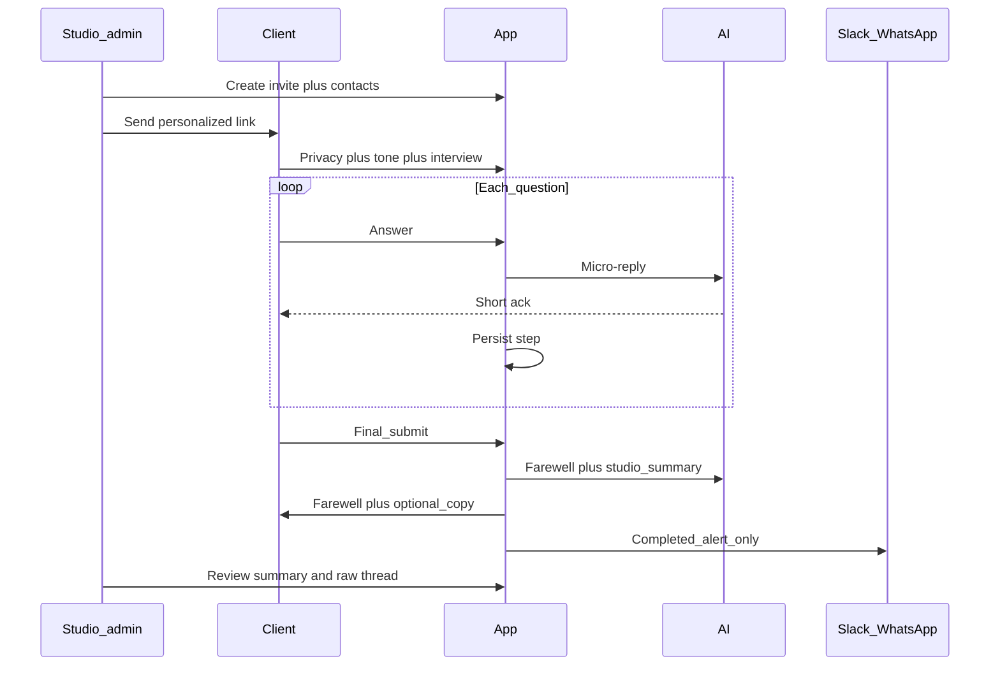

# Functional Requirements (Phase 1 / MVP)

**Status:** Draft v0.6  
**Last updated:** 2026-05-21  
**Companion:** [ux-requirements.md](./ux-requirements.md), [domain-models.md](./domain-models.md)

---

## 1. Product scope

Pre–live-call **discovery interview** for Idwasoft clients. Collects structured answers, stores the full conversational record, generates **studio prep artifacts**, and notifies the team.

**In scope (MVP):** invite → interview → persist → notify → admin review → AI summary for prep.  
**Out of scope (MVP):** post–live-call workflow, proposals, billing, public website embed, multi-tenant agencies.

---

## 2. Invite & admin

### 2.1 Invite generator (admin panel)

- **Studio-only** tool to create personalized interview links.
- **Auth:** Google OAuth; allow only **@idwasoft.com** (implementation detail in `technical/`).
- **Required invite fields:**
  - Contact name
  - Business name
  - Client email and/or WhatsApp (for optional copy delivery — see §5)
- **Optional invite fields:**
  - Business type / what the business is about (feeds personalization + AI summary)
- **Output:** unique URL per invite; encodes or binds invite context server-side.

### 2.2 Link behavior

- **No automatic expiry.**
- **Manual revoke** from admin panel (link shows closed / farewell state).
- **Resume:** same link continues where the client left off (see §3.2).
- **After final submit:** reopening link shows **same AI farewell experience** (no edit, no new interview).

### 2.3 Global admin settings (editable in panel)

- **Studio process** text — input for AI summary “proposed next steps” aligned with how Idwasoft works.
- **Notification channels** — which integrations fire on completion (Slack, WhatsApp, extensible list).
- **Client copy channels** — which channels may send the client their answers (email, WhatsApp, configurable).
- **Branding** — global Idwasoft settings (see UX doc).

### 2.4 Abandoned sessions

**TBD** — reminders, studio alerts, client nudges (deferred; do not block MVP build).

---

## 3. Interview session

### 3.1 Persistence

- **Save after every question** (answers + metadata) to avoid loss on disconnect or closed tab.
- Store **full conversation:**
  - Client answers (keyed by stable `questionId`)
  - Chosen register (`tú` / `usted`)
  - AI **micro-replies** per step
  - AI **farewell** message on completion
  - Timestamps / progress state
- **Resume** via same personalized link from last unanswered step.

### 3.2 Questions

- Content driven by interview schema (see [ux-requirements.md § Content](./ux-requirements.md#6-content-architecture)).
- **All questions required** to finish, each with explicit **“Prefiero no contestar”** (records skip without blocking completion).

### 3.3 Privacy (functional)

- Conversational notice (UX copy in UX doc): data is safe, used to personalize their experience.
- Link to full **aviso de privacidad**.
- Retention / deletion policy: define in `technical/` + legal review; must be documentable for clients.

---

## 4. AI outputs (functional)

Three distinct LLM use cases:

| Output | When | Audience |
|--------|------|----------|
| **Micro-reply** | After each answer (phases 1–5) | Client (on screen) |
| **Farewell message** | On final submit | Client (on screen + reopen) |
| **Studio prep summary** | On demand from admin (button) | Studio (admin panel only) |

### 4.1 Studio prep summary (MVP required)

Generated on demand from the admin panel (not on client `POST /api/talk/complete`) from full conversation + invite context + **editable studio process** from admin.

**Must cover:**

- Understanding the **customer** and **business**
- **Psychology / rapport** signals useful for a good commercial relationship
- **Proposed next steps** mapped to Idwasoft’s process (from admin process text)

**Displayed in admin panel** alongside raw conversation — not sent in Slack/WhatsApp notification.

### 4.2 LLM feature toggle

- **`Settings.llmEnabled`** — studio can turn AI replies/summary **on or off anytime** from admin.
- When off: template fallbacks only; interview flow unchanged; no external LLM calls.

### 4.3 Training data

Maintain diverse **answer → good micro-reply → bad micro-reply** examples (`content/training/` or equivalent) for prompt tuning and regression. Each good example should include **`sentimentId`** and register. See UX doc for dimensions.

### 4.4 Micro-reply sentiment & avatar media

| Requirement | Detail |
|-------------|--------|
| Closed sentiments | Every micro-reply maps to one id from the v1 catalog (§2 in [assistant-expression.md](./assistant-expression.md)) |
| LLM / template output | Return `sentimentId` + text; invalid id → `atenta` |
| Media registry | `content/assistant/sentiments.json` + files under `public/assets/assistant/{tu,usted}/` |
| Register variants | **Two assets per sentiment** — casual (tú) and formal (usted), not one shared portrait |
| Formats | WebP and/or GIF per slot; no raster “photo dump” without registry entry |
| Persistence | Store `sentimentId` (and register at send time) on `AiMessage` for replay |
| Preload | Client should preload assets for the active register where feasible |
| Echo | LLM may reuse one client word/phrase when appropriate; sentiment + register must stay consistent — [assistant-expression §5.1](./assistant-expression.md#51-echoing-the-clients-words-when-appropriate), [llm.md § Micro-reply copy rules](../technical/llm.md#micro-reply-copy-rules-prompt) |

Prototype today: **random** `sentimentId` per micro-reply (preview all portraits) + one PNG per id — production must map answers per §2.1 and implement the registry with tú/usted split. Echoing client words is not implemented in the prototype templates yet.

---

## 5. Completion — client

### 5.1 On final submit

1. Persist final state.
2. Show **AI-generated farewell** (conversational, delightful, same register) — team will follow up **ASAP** to schedule the live discovery call.
3. **Auto-send copy of answers** to client email/WhatsApp **if** contact was provided on invite and channel is enabled — **delightful** message and design (not plain text dump).
4. **Re-send copy** from admin panel at any time.

### 5.2 No post-submit editing

Client cannot change answers after submit; only farewell on return.

---

## 6. Completion — studio

### 6.1 Notifications

On complete, notify configured channels (**Slack, WhatsApp, extensible**):

- **Content:** completion alert only (e.g. client name, business, link to admin) — **not** full Q&A in the message.

### 6.2 Admin panel — review

Per invite / submission, studio can view:

| Artifact | Required MVP |
|----------|----------------|
| Raw conversation (Q + A + micro-replies + farewell) | Yes |
| AI prep summary | Yes |
| Proposal / strategy angles (from summary or structured sections) | Yes |
| Customer psychology notes (from summary or structured sections) | Yes |
| Chosen register, progress, invite metadata | Yes |
| Revoke link, re-send client copy | Yes |

### 6.3 Analytics (MVP)

**Minimal:** per-invite status (not started / in progress / completed) and timestamps. Deeper funnel metrics → `technical/` or post-MVP.

---

## 7. Distribution

| Stage | Behavior |
|-------|----------|
| **MVP** | Invite-only; not on public site nav |
| **Later** | Public on Idwasoft website; access mode = config toggle |

---

## 8. End-to-end flow

---

## 9. Out of scope (MVP)

- Live discovery call tooling and everything after it
- Public SEO / lead capture flow
- Client accounts / login
- Multi-studio / white-label per invite
- Visual CMS for interview questions (content = files v1; process text in admin)
- Abandoned-session automation (TBD)
- Heavy analytics

---

## 10. Open (for technical / plan)

- Database and storage schema
- Google OAuth implementation
- Slack / WhatsApp integration specifics
- LLM provider, timeouts, cost caps
- Interview schema file format and sync with `plantilla-entrevista-descubrimiento.md`
- Summary structure: single narrative vs JSON sections (psychology, strategies, next steps)
- Privacy retention period and delete-on-request workflow
