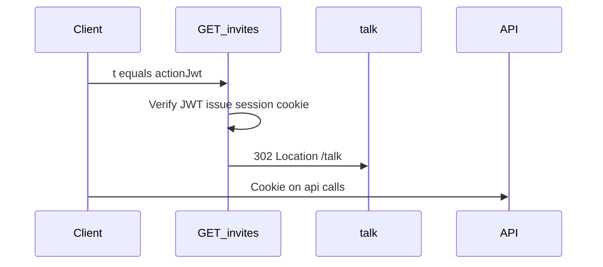

# Architecture (Phase 1 / MVP)

**Status:** Draft v0.1  
**Last updated:** 2026-05-21

---

## 1. Stack

| Layer | Choice |
|-------|--------|
| Runtime | PHP 8.2+ |
| Framework | Laravel 11 |
| Client UI | React 18, Tailwind CSS, Vite |
| Routing (browser) | React Router |
| SPA shell | Blade → single `index.html` entry |
| Database (production) | MySQL / MariaDB on shared hosting |
| Database (local) | **Docker** MySQL container (see §8) |
| LLM | [llm.md](./llm.md) — interface; MVP driver TBD |

---

## 2. URL design

**Principle:** English, user-friendly paths for humans; REST-style JSON under `/api/*`.

### 2.1 Customer (browser)

| Method | Path | Action |
|--------|------|--------|
| `GET` | `/invites?t={actionJwt}` | Validate JWT, create/load interview, set session cookie, redirect |
| `GET` | `/talk` | SPA — full interview UX (privacy → tone → questions → farewell) |

Customer link shared by studio: `https://{host}/invites?t=…`

After exchange, customer stays on `/talk` (single route; internal step state in React).

### 2.2 Customer (JSON API)

All require **interview session cookie** (except entry exchange).

| Method | Path | Purpose |
|--------|------|---------|
| `GET` | `/api/talk` | Bootstrap: interview `status`, invite metadata, **question content**, `progress`, static copy (privacy, tone) |
| `PATCH` | `/api/talk` | Save register: `{ "register": "tu" \| "usted" }` |
| `POST` | `/api/answers` | `{ "questionId", "answer", "skipped": boolean }` → persist + **micro-reply** (sync HTTP) |
| `POST` | `/api/talk/complete` | Final submit → farewell, studio summary (TBD), notifications, client copy (sync, no queue MVP) |

**Prefetch:** `GET /api/talk` returns full content; client caches locally. Subsequent steps only send `questionId` + answer text.

### 2.3 Studio (browser + API)

| Path | Purpose |
|------|---------|
| `/admin/*` | Same React SPA — invite generator, settings, review submissions |
| `/api/admin/*` | [admin-api.md](./admin-api.md) |

**Auth:** [auth.md](./auth.md) — Google OAuth + session cookie; `@idwasoft.com` only.

---

## 3. Authentication model

Two layers:



### 3.1 Action JWT (`t`)

- Generated in **admin panel** when creating an invite.
- Passed as query param: `/invites?t=…`
- **TTL: 7 days** (unless revoked earlier).
- Purpose: one-time **exchange** credential (not used on every API call).

### 3.2 Interview session cookie

- Set on successful `/invites?t=` handling.
- **HttpOnly**, **Secure** (prod), **SameSite=Lax**.
- **TTL: 7 days** maximum (sliding refresh on each authenticated API call).
- Binds browser to one `interview` row server-side.

**Resume:** If cookie expired but JWT still valid, customer re-opens `/invites?t=…` → new cookie → `GET /api/talk` restores `progress`.

**Revoked invite:** Entry or API returns closed state; no new cookie.

---

## 4. Entry handler (`GET /invites?t=`)

1. Verify action JWT (signature, expiry, not revoked).
2. Resolve invite + interview record.
3. Create session row; set cookie.
4. `302` → `/talk`.

**Errors:** invalid/expired `t` → error page (no cookie). Revoked → closed page.

---

## 5. `GET /api/talk` (bootstrap)

Minimum payload shape (illustrative — finalize with data models):

```json
{
  "status": "not_started | in_progress | completed | revoked",
  "invite": {
    "contactName": "…",
    "businessName": "…",
    "businessAbout": "…"
  },
  "register": "tu | usted | null",
  "contentVersion": "…",
  "content": { "phases": [] },
  "progress": {
    "answers": {},
    "currentQuestionId": null
  },
  "copy": {
    "privacy": "…",
    "toneOnboarding": "…"
  }
}
```

If `status === completed`, omit `content` or return farewell-only view — client shows farewell without question flow.

---

## 6. `POST /api/answers`

- Validate session + `questionId` exists in pinned content version.
- Persist answer (and `skipped` if “Prefiero no contestar”).
- Call LLM for **one-sentence micro-reply** (sync; timeout → template fallback).
- Return `{ "microReply": { "text": "…", "sentimentId": "smile" }, "progress": { … } }` — client loads avatar asset for `sentimentId` + interview register ([assistant-expression.md](../requierements/assistant-expression.md)).

**Communication:** standard HTTP request/response per step; optional skeleton UI on client immediately.

---

## 7. `POST /api/talk/complete`

**MVP (sync, no queue):**

1. Mark interview completed.
2. Generate AI **farewell** (client).
3. Generate AI **studio prep summary** (deferred prompt design).
4. Send **email** studio alert + **email** client copy if `client_email` set — [integrations.md](./integrations.md).

Client waits on this request — show loading. **Risk:** timeout on slow LLM; mitigations deferred (split response, jobs later).

---

## 8. Local development (Docker)

Use **Docker** for MySQL locally; Laravel `.env` points at container.

Typical setup (to be added in `plan/` or repo root later):

- `docker-compose.yml`: `mysql:8`, volume, port `3306`
- Host app: `php artisan serve` or Laragon/host PHP + Vite dev server
- Production: shared hosting MySQL (no Docker)

---

## 9. Interview content storage

- Domain entities: [domain-models.md](../requierements/domain-models.md).
- Tables and columns: [database-schema.md](./database-schema.md).
- Seed: [content-seed.md](./content-seed.md) from [plantilla-entrevista-descubrimiento.md](../plantilla-entrevista-descubrimiento.md).

---

## 10. Admin panel (same SPA)

- Routes under `/admin` (React Router guard).
- Google login → session for studio users.
- Features per [functional-requirements.md](../requierements/functional-requirements.md): invite generator (emits action JWT), revoke, review conversation + summary, re-send client copy, edit global studio process text, notification channel config.

Admin JSON API: `/api/admin/*` — detail with data models.

---

## 11. CSRF / cookies (SPA + API)

See [auth.md](./auth.md). Same origin; `credentials: 'include'`; CSRF on mutating routes.

---

## 12. Out of scope (technical MVP)

- Background queues / Redis
- SSE streaming for LLM (optional later)
- Separate mobile app
- Public unauthenticated `/talk` without invite JWT exchange

---

## 13. Next technical work

1. Laravel migrations from [database-schema.md](./database-schema.md).
2. **LLM** MVP implementation class (bind to interface).
3. **docker-compose** + env template in `plan/`.
4. **Admin API** route list.

See [decisions.md](./decisions.md).
