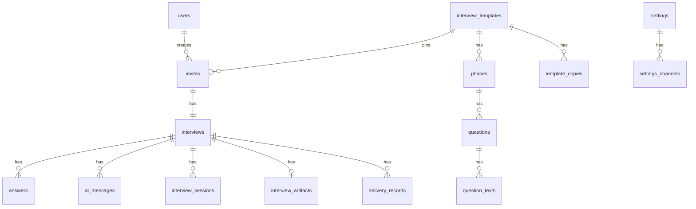

# Database schema

**Status:** Draft v0.1  
**Last updated:** 2026-05-21  
**Engine:** MySQL 8 / MariaDB (local via Docker)  
**Maps to:** [domain-models.md](../requierements/domain-models.md)

---

## Conventions

| Rule | Choice |
|------|--------|
| Primary keys | `id` — `BIGINT UNSIGNED` auto-increment, unless noted |
| Public ids | `CHAR(36)` UUID on `invites`, `interviews`, `interview_sessions` (cookie value) |
| Timestamps | `created_at`, `updated_at` on **every** table (`NULL`able timestamps off — Laravel defaults) |
| Strings | `VARCHAR` unless text is long (use `TEXT` / `LONGTEXT`) |
| Enums | MySQL `ENUM` or `VARCHAR` + app validation (migrations may use `string` + PHP enum) |
| JSON | Only where domain allows generic structure: `settings_channels.config` |
| Soft deletes | Not used in MVP |

Table names: Laravel plural snake_case.

---

## Entity–table map

| Domain model | Table |
|--------------|-------|
| `User` | `users` |
| `Settings` + `Branding` | `settings` |
| `Channel` | `settings_channels` |
| `InterviewTemplate` | `interview_templates` |
| `Phase` | `phases` |
| `Question` | `questions` |
| `QuestionText` | `question_texts` |
| `TemplateCopy` | `template_copies` |
| `Invite` | `invites` |
| `Interview` | `interviews` |
| `InterviewSession` | `interview_sessions` |
| `Answer` | `answers` |
| `AiMessage` | `ai_messages` |
| `InterviewArtifact` | `interview_artifacts` |
| `DeliveryRecord` | `delivery_records` |

---

## Studio

### `users`

| Column | Type | Notes |
|--------|------|-------|
| `id` | BIGINT PK | |
| `email` | VARCHAR(255) UNIQUE | Identity; Google login matches here |
| `name` | VARCHAR(255) NULL | |
| `password` | VARCHAR(255) NULL | Nullable for Google OAuth studio users |
| `created_at` | TIMESTAMP | |
| `updated_at` | TIMESTAMP | |

---

### `settings`

Singleton row in practice (`id = 1` seeded on install). Maps domain `Settings` + `Branding`.

| Column | Type | Notes |
|--------|------|-------|
| `id` | BIGINT PK | |
| `studio_process` | LONGTEXT NULL | Domain: `studioProcess` |
| `llm_enabled` | BOOLEAN DEFAULT true | Domain: `llmEnabled` — feature toggle |
| `privacy_notice_url` | VARCHAR(2048) NULL | |
| `logo_url` | VARCHAR(2048) NULL | Branding |
| `logo_alt` | VARCHAR(255) NULL | |
| `primary_color` | VARCHAR(32) NULL | e.g. `#0F172A` |
| `accent_color` | VARCHAR(32) NULL | |
| `display_name` | VARCHAR(255) NULL | |
| `tagline` | VARCHAR(512) NULL | |
| `created_at` | TIMESTAMP | |
| `updated_at` | TIMESTAMP | |

---

### `settings_channels`

One row per domain `Channel` in `Settings.channels`.

| Column | Type | Notes |
|--------|------|-------|
| `id` | BIGINT PK | |
| `settings_id` | BIGINT FK → `settings.id` | |
| `channel_key` | VARCHAR(64) | Domain `Channel.id` (stable slug, e.g. `slack-team`) |
| `name` | VARCHAR(255) | |
| `type` | VARCHAR(32) | `slack`, `whatsapp`, `email`, … |
| `config` | JSON | Generic connection object; encrypt at app layer if needed |
| `created_at` | TIMESTAMP | |
| `updated_at` | TIMESTAMP | |

**Indexes:** `UNIQUE (settings_id, channel_key)`

---

## Interview content

### `interview_templates`

| Column | Type | Notes |
|--------|------|-------|
| `id` | BIGINT PK | |
| `version` | VARCHAR(32) | Domain label, e.g. `1.0.0` |
| `published_at` | TIMESTAMP NULL | |
| `is_active` | BOOLEAN DEFAULT false | One active template for new invites (app-enforced) |
| `created_at` | TIMESTAMP | |
| `updated_at` | TIMESTAMP | |

**Indexes:** index on `is_active` (optional)

---

### `phases`

| Column | Type | Notes |
|--------|------|-------|
| `id` | BIGINT PK | |
| `interview_template_id` | BIGINT FK → `interview_templates.id` | |
| `code` | VARCHAR(16) | e.g. `0`, `1`, … `5` |
| `sort_order` | UNSIGNED SMALLINT | |
| `created_at` | TIMESTAMP | |
| `updated_at` | TIMESTAMP | |

**Indexes:** `UNIQUE (interview_template_id, code)`

---

### `questions`

| Column | Type | Notes |
|--------|------|-------|
| `id` | BIGINT PK | |
| `phase_id` | BIGINT FK → `phases.id` | |
| `code` | VARCHAR(16) | Stable, e.g. `1.1` — unique per template |
| `sort_order` | UNSIGNED SMALLINT | |
| `input_type` | VARCHAR(32) | e.g. `long_text` |
| `sensitivity` | VARCHAR(16) NULL | Optional; e.g. `high` |
| `created_at` | TIMESTAMP | |
| `updated_at` | TIMESTAMP | |

**Indexes:** `UNIQUE (phase_id, code)`; index `code` for lookups

---

### `question_texts`

| Column | Type | Notes |
|--------|------|-------|
| `id` | BIGINT PK | |
| `question_id` | BIGINT FK → `questions.id` | |
| `field` | VARCHAR(32) | `label`, `hint`, … |
| `register` | VARCHAR(16) | `neutral`, `tu`, `usted` |
| `body` | TEXT | |
| `created_at` | TIMESTAMP | |
| `updated_at` | TIMESTAMP | |

**Indexes:** `UNIQUE (question_id, field, register)`

---

### `template_copies`

| Column | Type | Notes |
|--------|------|-------|
| `id` | BIGINT PK | |
| `interview_template_id` | BIGINT FK → `interview_templates.id` | |
| `key` | VARCHAR(64) | e.g. `privacy`, `tone_onboarding` |
| `register` | VARCHAR(16) | `neutral`, `tu`, `usted` |
| `body` | TEXT | |
| `created_at` | TIMESTAMP | |
| `updated_at` | TIMESTAMP | |

**Indexes:** `UNIQUE (interview_template_id, key, register)`

---

## Client engagement

### `invites`

| Column | Type | Notes |
|--------|------|-------|
| `id` | CHAR(36) PK | UUID |
| `user_id` | BIGINT FK → `users.id` | Creator |
| `interview_template_id` | BIGINT FK → `interview_templates.id` | Pinned at create |
| `contact_name` | VARCHAR(255) | |
| `business_name` | VARCHAR(255) | |
| `business_about` | TEXT NULL | |
| `client_email` | VARCHAR(255) NULL | |
| `client_whatsapp` | VARCHAR(64) NULL | |
| `token_jti` | VARCHAR(64) UNIQUE | JWT id for validation / revoke |
| `access_token_expires_at` | TIMESTAMP | 7-day window from issue |
| `status` | VARCHAR(16) | `active`, `revoked` |
| `revoked_at` | TIMESTAMP NULL | |
| `created_at` | TIMESTAMP | |
| `updated_at` | TIMESTAMP | |

**Note:** Full JWT is not stored — only `token_jti` + expiry. JWT payload includes `invite_id`.

---

### `interviews`

| Column | Type | Notes |
|--------|------|-------|
| `id` | CHAR(36) PK | UUID |
| `invite_id` | CHAR(36) FK → `invites.id` UNIQUE | 1:1 with invite |
| `status` | VARCHAR(16) | `not_started`, `in_progress`, `completed` |
| `register` | VARCHAR(16) NULL | `tu`, `usted` |
| `current_question_code` | VARCHAR(16) NULL | Resume pointer |
| `privacy_acknowledged_at` | TIMESTAMP NULL | |
| `started_at` | TIMESTAMP NULL | |
| `completed_at` | TIMESTAMP NULL | |
| `created_at` | TIMESTAMP | |
| `updated_at` | TIMESTAMP | |

**Indexes:** `status` for admin lists

---

### `interview_sessions`

Cookie value = `id` (UUID).

| Column | Type | Notes |
|--------|------|-------|
| `id` | CHAR(36) PK | UUID — HttpOnly cookie |
| `interview_id` | CHAR(36) FK → `interviews.id` | |
| `expires_at` | TIMESTAMP | 2-hour window (sliding refresh in app) |
| `last_seen_at` | TIMESTAMP | |
| `created_at` | TIMESTAMP | |
| `updated_at` | TIMESTAMP | |

**Indexes:** `interview_id`, `expires_at`

---

## Conversation

### `answers`

| Column | Type | Notes |
|--------|------|-------|
| `id` | BIGINT PK | |
| `interview_id` | CHAR(36) FK → `interviews.id` | |
| `question_code` | VARCHAR(16) | Matches `questions.code` on pinned template |
| `body` | TEXT NULL | Null when `skipped` |
| `skipped` | BOOLEAN DEFAULT false | “Prefiero no contestar” |
| `created_at` | TIMESTAMP | |
| `updated_at` | TIMESTAMP | |

**Indexes:** `UNIQUE (interview_id, question_code)`

---

### `ai_messages`

| Column | Type | Notes |
|--------|------|-------|
| `id` | BIGINT PK | |
| `interview_id` | CHAR(36) FK → `interviews.id` | |
| `type` | VARCHAR(16) | `micro_reply`, `farewell` |
| `question_code` | VARCHAR(16) NULL | For `micro_reply` |
| `content` | TEXT | |
| `sequence` | UNSIGNED INT | Order in thread |
| `sentiment_id` | VARCHAR(32) NULL | Lisa expression id when applicable |
| `register` | VARCHAR(16) NULL | `tu`, `usted`, `neutral` |
| `source` | VARCHAR(16) DEFAULT `template` | `template` or `llm` |
| `created_at` | TIMESTAMP | |
| `updated_at` | TIMESTAMP | |

**Indexes:** `(interview_id, sequence)`

---

## After completion

### `interview_artifacts`

| Column | Type | Notes |
|--------|------|-------|
| `id` | BIGINT PK | |
| `interview_id` | CHAR(36) FK → `interviews.id` UNIQUE | One per interview |
| `analysis_json` | JSON NULL | Structured studio analysis (on-demand, E7.3) |
| `schema_version` | VARCHAR(16) DEFAULT `1` | Version of `analysis_json` shape |
| `generated_at` | TIMESTAMP NULL | Set when analysis is generated |
| `created_at` | TIMESTAMP | |
| `updated_at` | TIMESTAMP | |

---

### `delivery_records`

| Column | Type | Notes |
|--------|------|-------|
| `id` | BIGINT PK | |
| `interview_id` | CHAR(36) FK → `interviews.id` | |
| `channel_key` | VARCHAR(64) | Snapshot of `settings_channels.channel_key` |
| `channel_type` | VARCHAR(32) | Snapshot at send time |
| `status` | VARCHAR(32) | e.g. `sent`, `failed` |
| `sent_at` | TIMESTAMP NULL | |
| `created_at` | TIMESTAMP | |
| `updated_at` | TIMESTAMP | |

---

## Referential integrity (delete rules)

| Parent | Child | On delete |
|--------|-------|-----------|
| `interview_templates` | `phases`, `template_copies` | RESTRICT (don’t delete template with invites) |
| `phases` | `questions` | CASCADE |
| `questions` | `question_texts` | CASCADE |
| `invites` | `interviews` | RESTRICT or CASCADE — prefer **RESTRICT** |
| `interviews` | `answers`, `ai_messages`, `sessions`, `artifacts`, `delivery_records` | CASCADE |
| `settings` | `settings_channels` | CASCADE |

---

## ER diagram

---

## Laravel model names (reference)

| Table | Eloquent model |
|-------|----------------|
| `users` | `User` |
| `settings` | `Settings` |
| `settings_channels` | `SettingsChannel` |
| `interview_templates` | `InterviewTemplate` |
| `phases` | `Phase` |
| `questions` | `Question` |
| `question_texts` | `QuestionText` |
| `template_copies` | `TemplateCopy` |
| `invites` | `Invite` |
| `interviews` | `Interview` |
| `interview_sessions` | `InterviewSession` |
| `answers` | `Answer` |
| `ai_messages` | `AiMessage` |
| `interview_artifacts` | `InterviewArtifact` |
| `delivery_records` | `DeliveryRecord` |

---

## Seed order

1. `settings` (+ default `settings_channels` if any)
2. `interview_templates` → `phases` → `questions` → `question_texts`, `template_copies` (from plantilla)
3. `users` (studio team)

---

## Not in schema (by design)

- Full JWT string — derived at runtime; only `token_jti` stored
- Interview content as JSON blobs on `invites` — normalized tables only
- LLM prompt/response audit — optional future `ai_message_metadata` column on `ai_messages`
